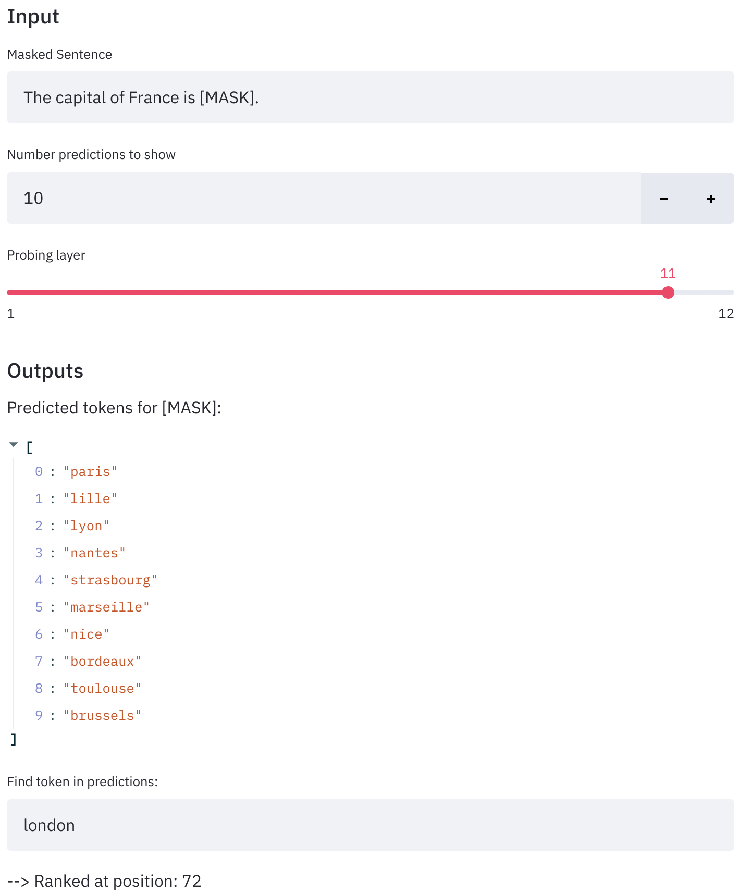

# Knowledge Probing

---

Knowledge probing is a framework that allows probing for BERT's world knowledge. It builds on the work and the probing data by Petroni et. al. ([https://github.com/facebookresearch/LAMA](https://github.com/facebookresearch/LAMA)). Unlike others, this framework allows for probing all layers of BERT and fine-tuned BERT-models. To do so, a masked language modeling head is fine-tuned to the embeddings of the probing layer. More details on the methodology can be found in the paper (LINK). 

---

## Getting Started

1. Clone repository
2. Create virtual environment

    ```bash
    $ conda create -n knowledge-probing python=3.7 
    ```

3. Install pytorch 1.5 (inclusive CUDA if you want to use a GPU)
4. Install requirements:  

    ```bash
    $ pip install -r requirements.txt
    ```

5. Run the setup script in /scripts/ that downloads the data and creates neccessary folders: 

    ```bash
    $ sh setup.sh 
    ```

6. That's it! Run your experiments!

### Configure Experiments

Probing experiments can be configured by specifying the relevant flag to the call. To probe layer 10 of the regular pre-trained BERT with a randomly initialyzed decoder:

```bash
$ python run_probing.py \
        --decoder_type random \
        --do_training \
        --do_probing \
        --probing_layer 10
```

### Weights and Biases Integration

Training and probing is integrated with Weights and Biases. To log your experiments with W&B, simply add these flags to the program call: 

```bash
$ python run_probing.py \
			... \
			--use_wandb_logging \
			--wandb_project_name probe_bert_model \
```

### Data

Data is two parted: Data for training the decoder and for probing. 

1. Decoder Training Data
The decoder is trained with text data from Wikitext-2 ([https://s3.amazonaws.com/research.metamind.io/wikitext/wikitext-2-raw-v1.zip](https://s3.amazonaws.com/research.metamind.io/wikitext/wikitext-2-raw-v1.zip)). Other training data can be used by supplying the paths to the train/validation files (and possibly writing a short dataset class if the data's structure is different than Wikitext-2's).  
2. Probing Data
The probing data was modeled in the LAMA paper by Petroni et. al. ([https://github.com/facebookresearch/LAMA](https://github.com/facebookresearch/LAMA)) and can be downloaded from here: [https://dl.fbaipublicfiles.com/LAMA/data.zip](https://dl.fbaipublicfiles.com/LAMA/data.zip). Other probing data such as LAMA UHN ([https://arxiv.org/abs/1911.03681v1](https://arxiv.org/abs/1911.03681v1)) can be used. Have a look at knowledge_probing/probing/probing.py. 

### Models

Knowledge probing can be done for various pre-trained or fine-tuned BERT-models. You can either supply your own models or load models from the huggingface model hub ([https://huggingface.co/models](https://huggingface.co/models)).

Models from the huggingface model hub can easily downloaded:

```python
from transformers import AutoModel

model = AutoModel.from_pretrained("<MODEL_NAME_FROM_MODEL_HUB>")
model.save_pretrained('<PATH>')
```

To probe own models, make sure to set the according flag when running the scirpt:

```bash
--use_model_from_dir
```

### Logs

Upon probing termination, all results will be written to a json file. Logged metrices such as precision, as well as individual predictions for each fact will be grouped for each relation and each dataset: 

```
{  
"Google_RE": {
		...,
		"place_of_birth": [
			{
				"MRR": ...,
				"P_AT_1": ...,
				"P_AT_10": ...,
				"P_AT_100": ...,
				"individual_predictions": [
					{
					"sample": {
						"masked_sentences": [...],
						"obj_label": ...
					},
					"P_AT_100": ...,
					"P_AT_10": ...,
					"P_AT_1": ...,
					"MRR": ...,
					"top_k_tokens": [...],
					"rank": ...
					},
					...
				]
			}
		]
	}
}
```

---

## Exploring BERT's Predictions

This repository also offers a tool for visual exploration of the predictions. The prediction exploration tool is built with streamlit and allows for an interactive inspection of the predictions of pre-trained or fine-tuned models. As of yet, the tool is not being served to the weg. Therefore, you will have to run it locally:

1. Install streamlit ([https://www.streamlit.io/](https://www.streamlit.io/))
2. Run the streamlit app via:  

    ```bash
    streamlit run examples/prediction_explorer.py
    ```

After selecting a model (and optionally a trained decoder for a layer), one can query the model for arbitrary masked sentences and inspect the predictions. 



---

## Reference

Will follow, paper not released yet.